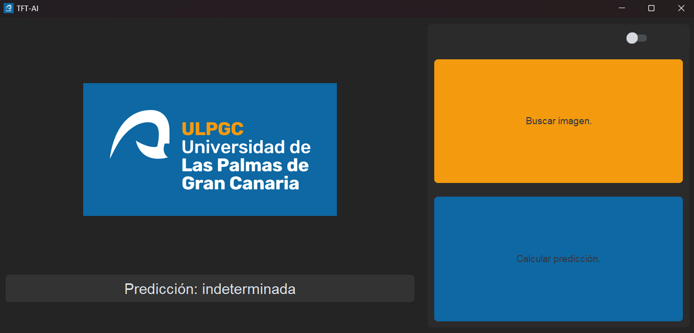

# TensorFlow Image Classification with Convolutional Neural Network

This project uses TensorFlow to implement a Convolutional Neural Network (CNN) for image classification. The goal is to classify skin lesion images into different categories. The dataset used is HAM10000, which contains skin lesion images with associated metadata.

When this project is executed for the first time it will create, train, evaluate, and save a model to be used in the next executions of the script.

## Run Locally

Before running the code, make sure you have the necessary libraries installed. You can install them using the following:

```bash
pip install -r requirements.txt
```

1. Download the **HAM10000** dataset from this [link](https://dataverse.harvard.edu/dataset.xhtml?persistentId=doi:10.7910/DVN/DBW86T). 

2. Copy the **dataverse_files.zip** file inside the **AI/data/** folder.

3. Unzip the file with the option "**unzip into dataverse_files**".

4. Inside the new **dataverse_files/** folder unzip the **HAM10000_images_part_1.zip** file with the option "**unzip into HAM10000_images_part_1**"

5. Inside the new **dataverse_files/** folder unzip the **HAM10000_images_part_2.zip** file with the option "**unzip into HAM10000_images_part_2**"

6. Change the file type of the **HAM10000_metadata** file to **HAM10000_metadata.csv**

## Usage

To run the program, use the following command:

```bash
python.exe AI/TFT-AI.py
```

## Hints

I highly recommend creating a "venv." in the project directory to include there all the dependencies and libraries for the project.

To know what type of disease belongs to the selected image, I would recommend creating a table in a relational database like Postgres with the content of the **HAM10000_metadata.csv** file, in order to make SQL queries related to the selected image.

## Configuration

Adjust the configuration parameters in the script as needed:

- EPOCHS: Number of training epochs.

- IMG_WIDTH and IMG_HEIGHT: Image dimensions for preprocessing.

- NUM_CATEGORIES: Number of output categories.

- TEST_SIZE: Percentage of data left out of testing.

- MODEL_NAME: Name of the saved model file.

- MODEL_DIR: Directory to save the trained model.

- METADATA_FILE: Path to the metadata CSV file.

- IMAGES_FOLDER_PART1 and IMAGES_FOLDER_PART2: Paths to the image folders.

## Model Architecture

The implemented CNN model consists of convolutional layers, max-pooling layers, flattening layers, dense layers, and a dropout layer to prevent overfitting. The model is compiled using the Adam optimizer and categorical cross-entropy loss.

Feel free to experiment with the model architecture and hyperparameters to achieve better performance.

## Data Loading and Preprocessing

The script loads image data and corresponding labels from the provided dataset. Images are resized to the specified dimensions. The dataset is split into training and testing sets using scikit-learn.

## Dataset

The HAM10000 dataset is used for training and testing the model. Make sure to adjust the paths if you use a different dataset.

## Features

- Ham 10000 dataset prediction with +90% accuracy.

- Light/dark mode toggle.

- Cross platform.

## Tech Stack

**Desktop applicacion:** Python, opencv-python, scikit-learn, tensorflow, customtkinter, numpy3, Pillow0,pandas, imbalanced-learn, matplotlib, imblearn, auto-py-to-exe, seaborn2 

## Support

For support, email sergiocastellanotrabajo@gmail.com.

## Screenshots



## Authors

- [@SCASTELLANO6044](https://www.github.com/scastellano6044)

